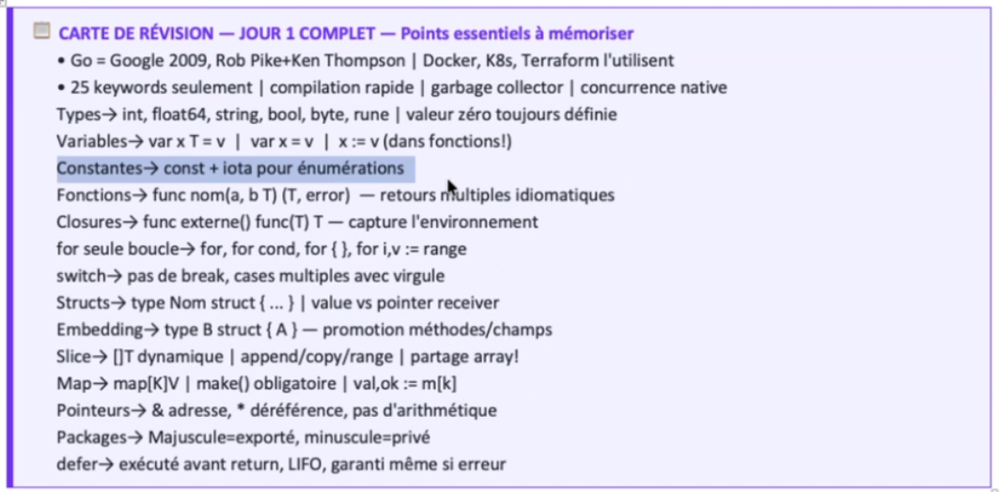

# Notes Go

## Variables

Déclaration longue : var nomvar type = 10
Déclaration courte (seulement dans une fonction) : nomvar := 10

Constante : const NOM = valeur (pas de type obligatoire)

float64 pour les décimaux, int pour entiers, string, bool

Conversion de type obligatoire : uint64(maVariable) — Go cast pas automatiquement

## Types

int, uint64, float64, string, bool
uint64 = entier positif seulement (unsigned)

Slice /= array car c'est un tableau à taille dynamique
array : var arr [3]int = [3]int{1, 2, 3} — taille fixe
slice : var s []int = []int{1, 2, 3} — taille dynamique, append() pour ajouter

## Fonctions

func nomFonction(param type) typeRetour { }

Retours multiples : func nomFonction(a, b float64) (float64, error) { }
— très utilisé pour retourner un résultat + une erreur en même temps
— l'appelant doit gérer les deux : resultat, err := operer(a, b, "+")
— ignorer une valeur de retour avec _ : resultat, _ := ...

Closure = fonction qui retourne une fonction
ex: func creerOperation(op string) func(float64, float64) float64 {
        return func(a, b float64) float64 { ... }
    }
La fonction retournée "capture" la variable op du scope parent

## Conditions

if / else if / else — pas de parenthèses autour de la condition

switch op {
case "+":
    ...
case "/":
    ...
default:
    ...
}

fallthrough : force l'exécution du case suivant même si la condition match pas
— comportement inverse de la plupart des langages (Java/C font fallthrough par défaut)
— rarement utilisé, surtout pour regrouper des cas similaires
ex:
switch note {
case 10:
    fallthrough
case 9:
    fmt.Println("Excellent")
}

## Boucles

for { } = while true (boucle infinie)
for i := 0; i < 10; i++ { }
for condition { } = while condition

break pour sortir, continue pour passer à l'itération suivante

## Erreurs

errors.New("message") — créer une erreur simple
fmt.Errorf("message %s", variable) — erreur avec formatage

if err != nil { } — vérifier si y'a une erreur

## iota

iota = compteur automatique dans un bloc const, commence à 0 et s'incrémente à chaque ligne
sert à créer des constantes numérotées sans taper les chiffres à la main

ex:
const (
    Lundi = iota  // 0
    Mardi         // 1
    Mercredi      // 2
)

peut faire des calculs dessus :
const (
    _  = iota        // ignore le 0
    Ko = 1 << (10 * iota)  // 1024
    Mo                     // 1048576
    Go                     // 1073741824
)

## Imports

import "fmt" — print, scan, errorf
import "math" — math.Pow, math.Sqrt etc
import "errors" — errors.New

Plusieurs imports :
import (
    "fmt"
    "math"
)

## fmt

fmt.Println() — affiche avec retour à la ligne
fmt.Printf("%.2f\n", val) — formatage (%.2f = 2 décimales)
fmt.Scan(&a, &b, &op) — lit depuis l'entrée standard, & pour passer l'adresse

## math (vu dans calcul.go)

math.Pow(base, exposant) — puissance — retourne float64 donc faut caster
